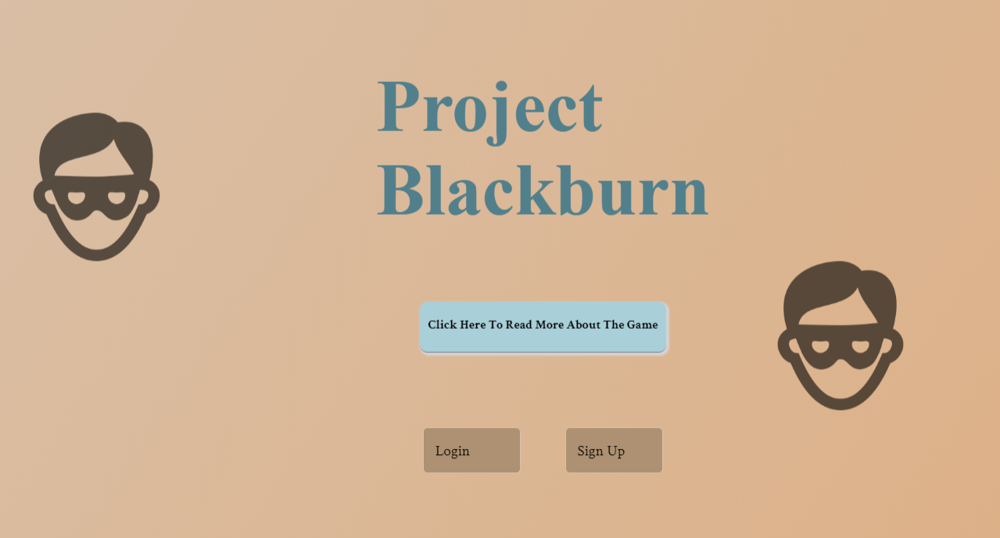
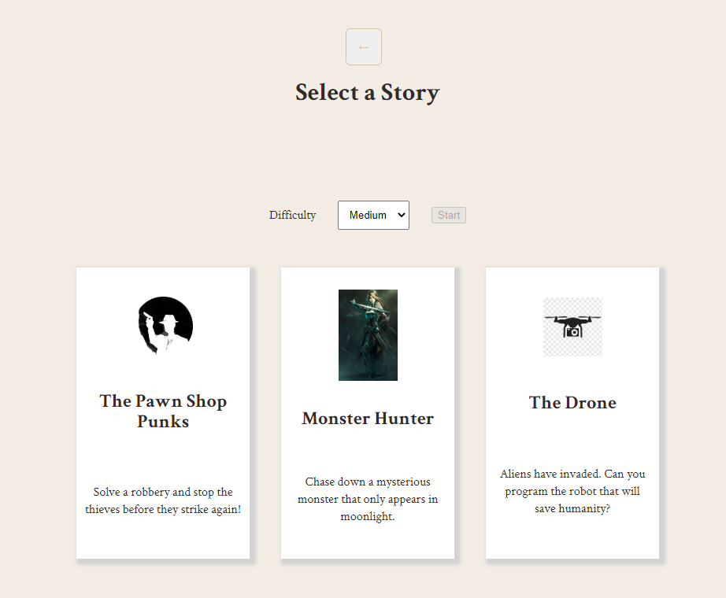
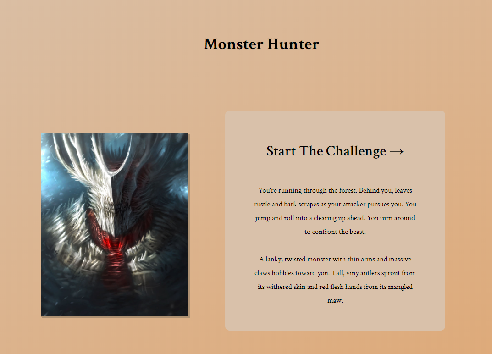
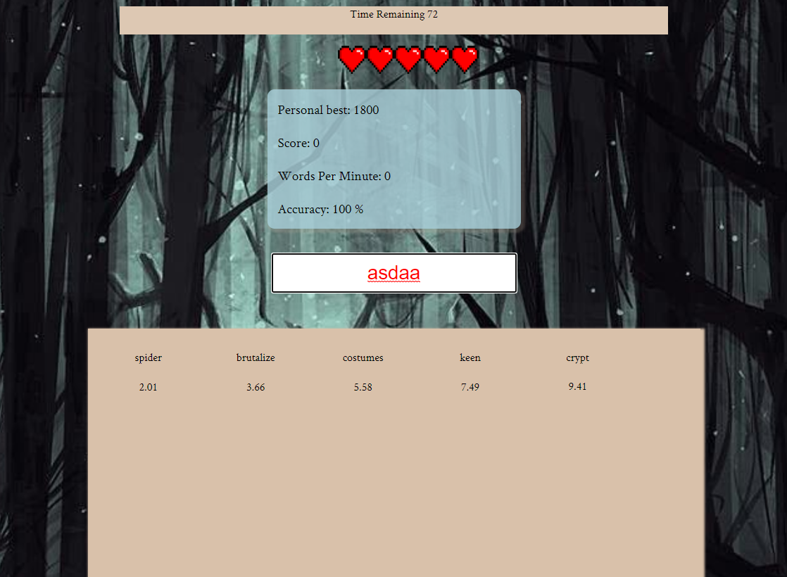

# Application

Project Blackburn

# Teammates

Tyler Sharp
Nicholas Evelson
Ren Finn
Jacob Flaxman

# Summary

Whether to increase your typing accuracy or speed, everyone could
benefit from a typing tutor. The trouble is that practicing typing
the conventional way is boring, and most typing games forget that
they should be games first and typing tutors second.

That's why we built Project Blackburn, A typing tutor that knows
how to make learning fun! Project Blackburn hosts a collection of
campaigns from your to choose from that help you increase your
typing skill. Each campaign can be played on multiple difficulty
settings, and your runs are recorded to track your progress over
time. Project Blackburn also has a leaderboard so you can compete
to be the fastest typer!

# Links

You can find the live site here:
https://project-blackburn-client.vercel.app/

The back end can be contacted through this api:
https://lower-goose-32788.herokuapp.com/api

# How to use the API

The api for this project lets you perform GET and POST requests to fetch from and contribute to the users, and story databases
Here are some examples of how to use the API:

(Unprotected Endpoint)GET /api/auth
Register: POST /api/users - takes in username, password, avatar > Returns a bearer authentication token for the user
Example request body:
{
username: "testuser",
password: "testpass01!",
avatar: "spy"
}
Scoreboard: /api/scoreboard

GET requests need a request param, scores for individual users need a userid, individual storyids (for all users) need a story id param.

Request can be "all", "story", or "myscores". All requires nothing, myscores requires userid and story requires storyid

Examples:

GET all scores: /api/scoreboard?request=all
GET all user scores: /api/scoreboard?request=myscores&userid=123
GET all scores for a story: /api/scoreboard?request=story&storyid=detective

POST requests take in user_id (int), story_id (str), score (int), difficulty_id (str), wpm (int), accuracy (int)

# Screen shots

# Technologies used

This project was completed with the following technologies:

1. React
2. Javascript
3. PostgreSQL
4. Mocha
5. Chai

## Development Set up

Complete the following steps to use this project:

1. Clone this repository to your local machine `git clone NEW-PROJECTS-URL NEW-PROJECTS-NAME`
2. `cd` into the cloned repository
3. Make a fresh start of the git history for this project with `rm -rf .git && git init`
4. Install the node dependencies `npm install`
5. Move the example Environment file to `.env` that will be ignored by git and read by the express server `mv example.env .env`

## Scripts

Start the application `npm start`
Start nodemon for the application `npm run dev`
Run the tests `npm test`

## Deploying

When your new project is ready for deployment, add a new Heroku application with `heroku create`. This will make a new git remote called "heroku" and you can then `npm run deploy` which will push to this remote's master branch.
